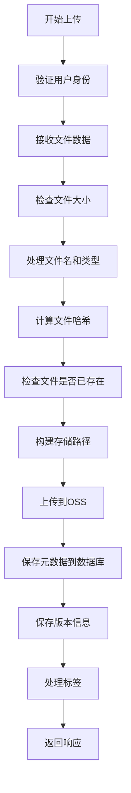
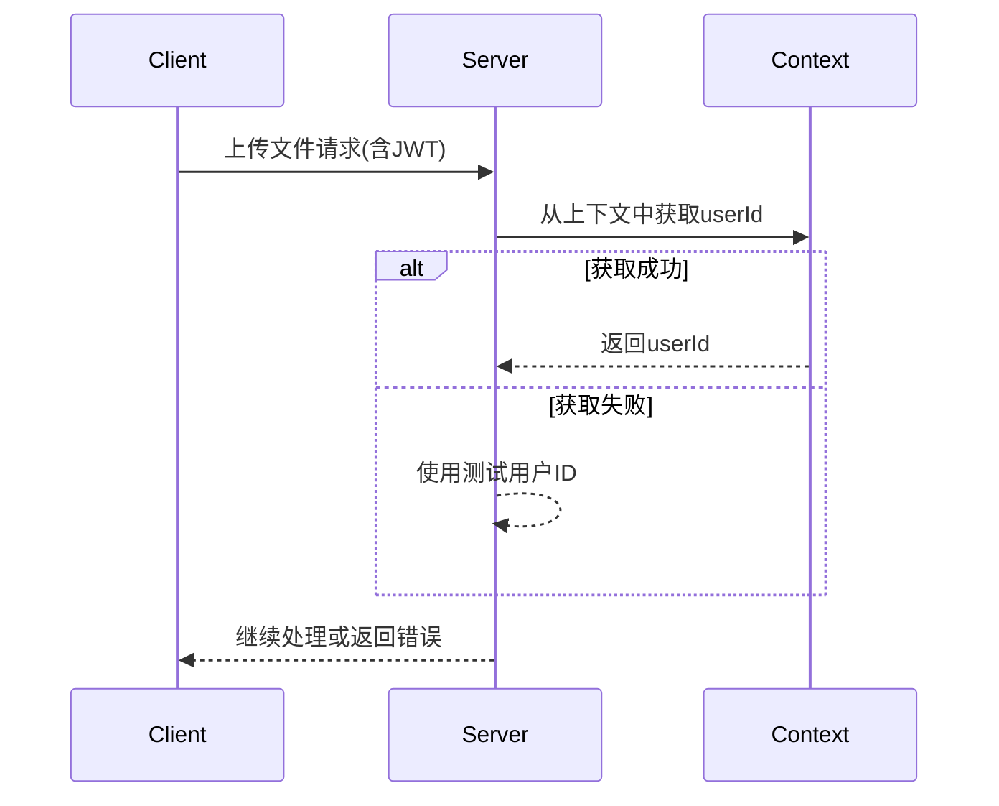
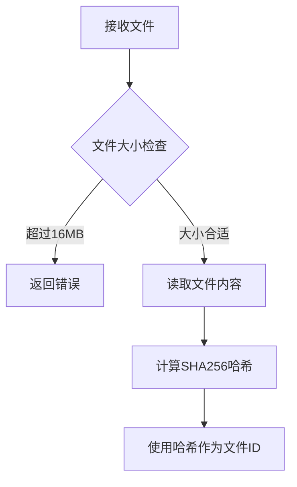
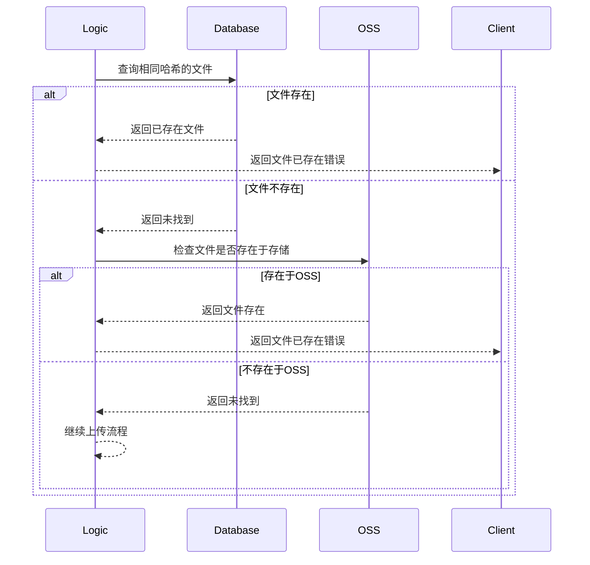
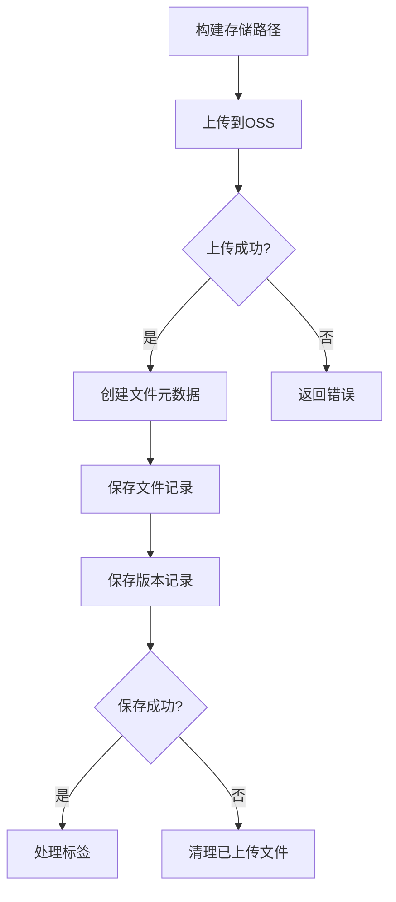
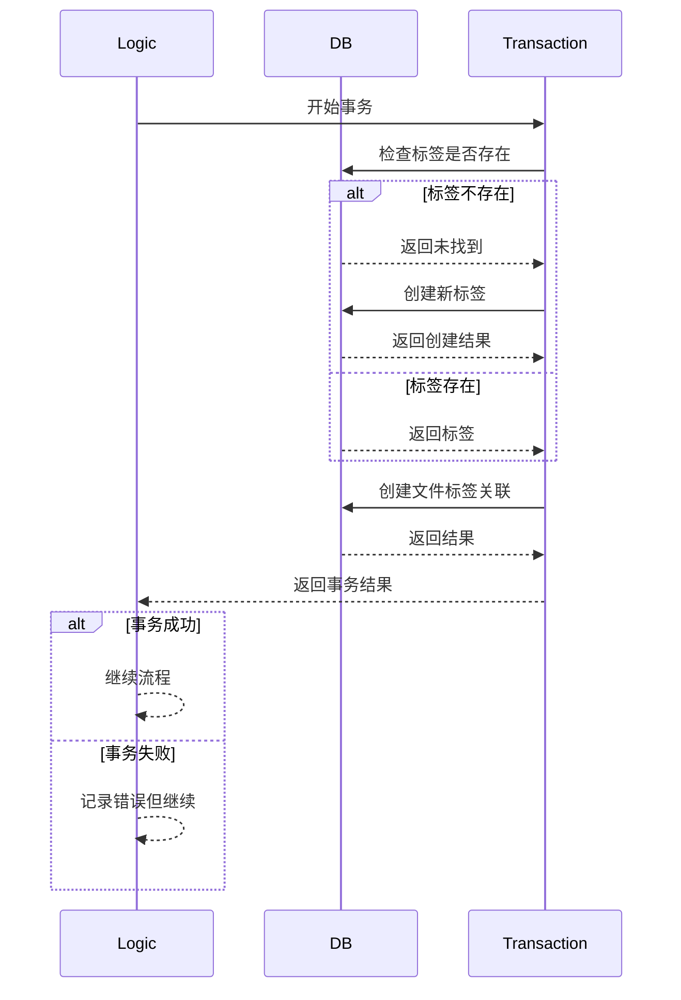
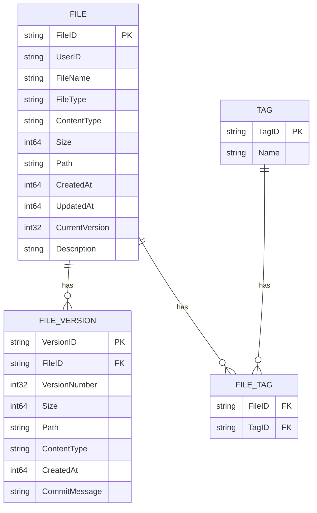
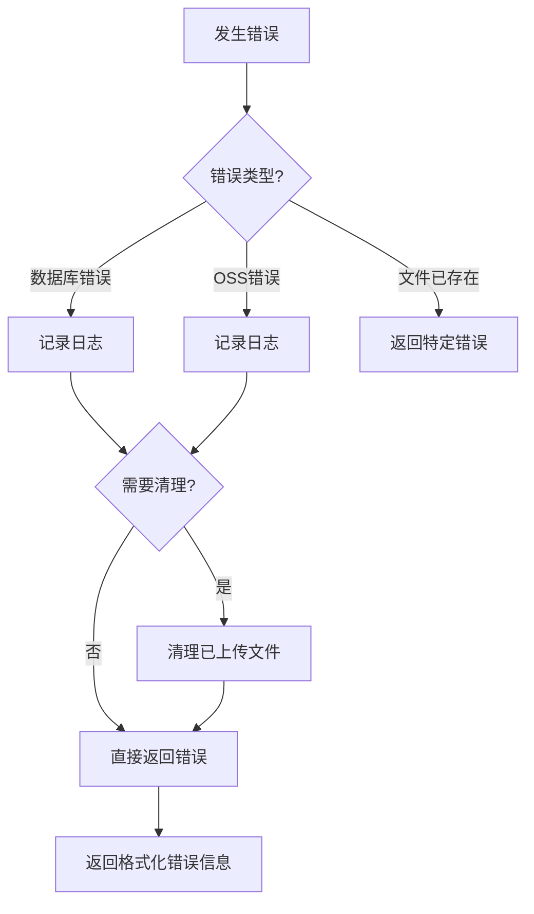

详细介绍这个逻辑文件后这里做了什么,尽量多一点 mermaid 的图表

参考以下文件

# 文件上传处理流程详解

下面我将详细介绍上传文件后的处理流程，并使用多个mermaid图表来可视化整个过程。

## 整体流程概览

## 详细步骤分析

### 1. 用户身份验证

### 2. 文件接收与验证

### 3. 文件去重检查

### 4. 文件存储与元数据保存

### 5. 标签处理流程

## 数据库模型关系

## 错误处理流程

## 关键点说明

1. **文件去重**：通过SHA256哈希值确保相同内容文件不会重复存储
2. **存储结构**：使用`userId/yearMonth/fileHash`的路径结构组织文件
3. **事务处理**：标签处理使用数据库事务确保一致性
4. **错误恢复**：在关键步骤失败时自动清理已上传的文件
5. **元数据管理**：同时维护文件基本信息和版本历史

整个流程设计考虑了安全性、效率和可靠性，确保文件上传过程稳定且数据一致。
