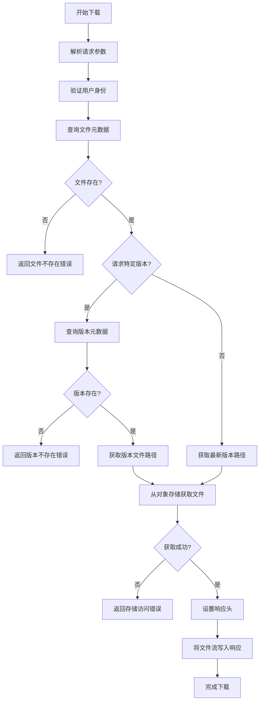
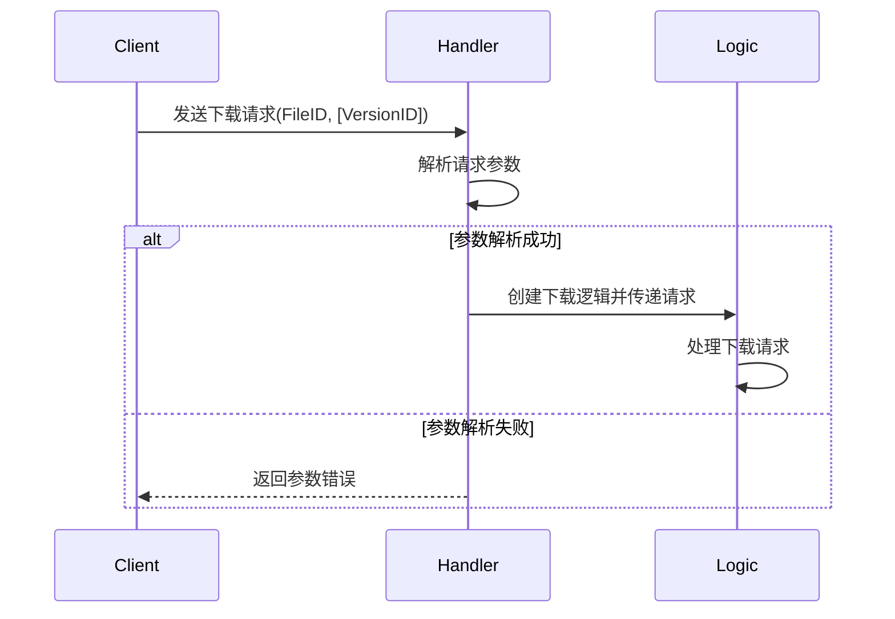
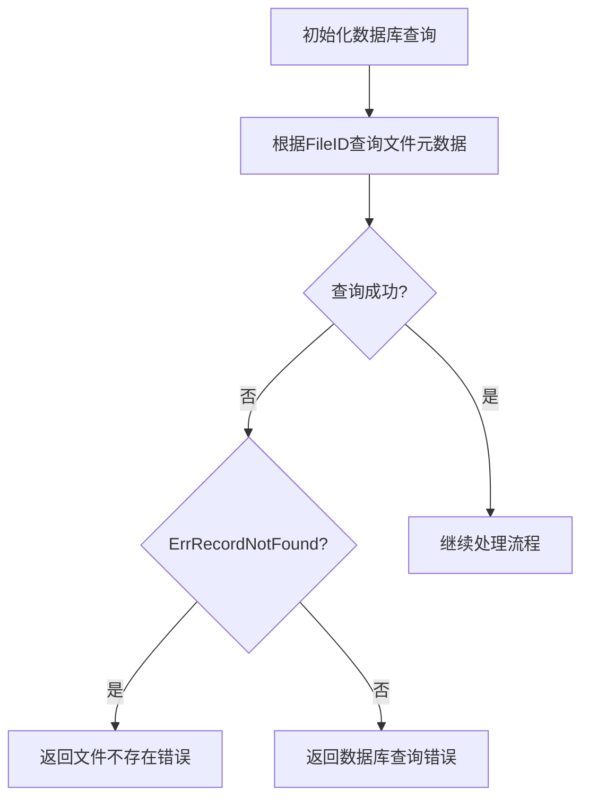
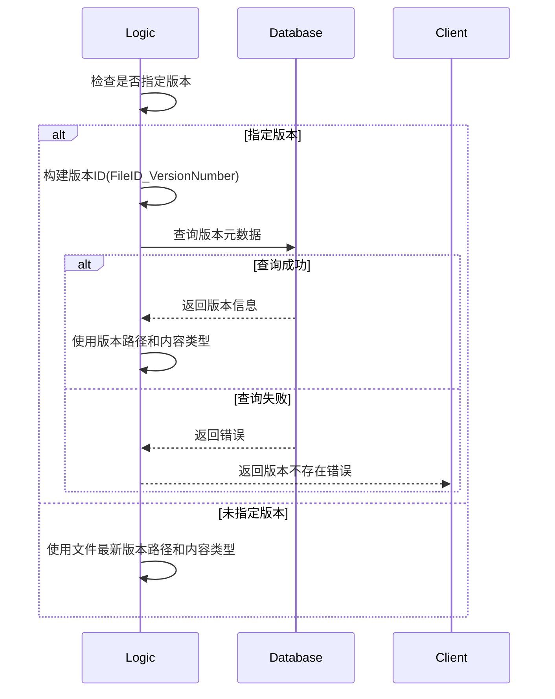
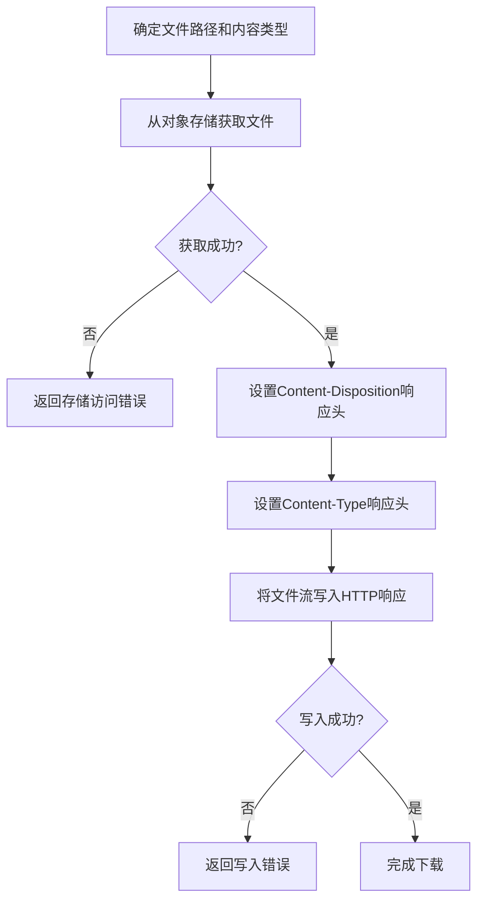
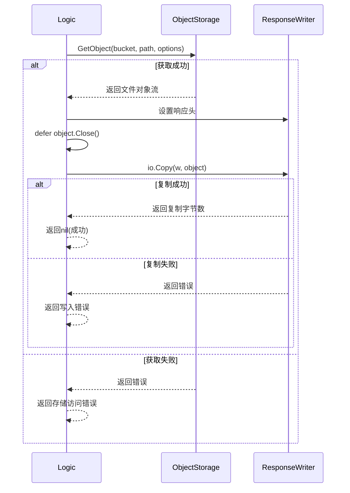
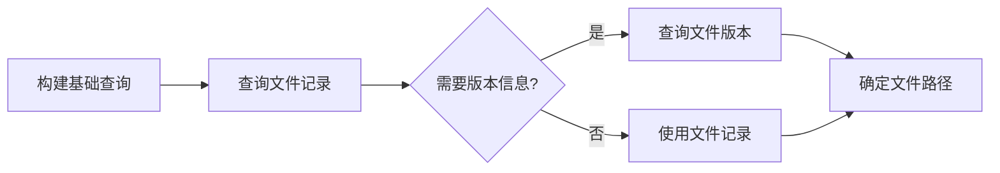
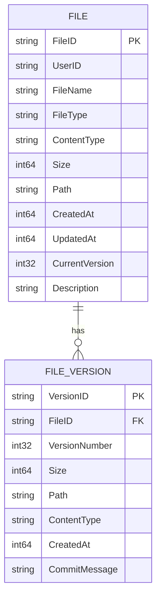
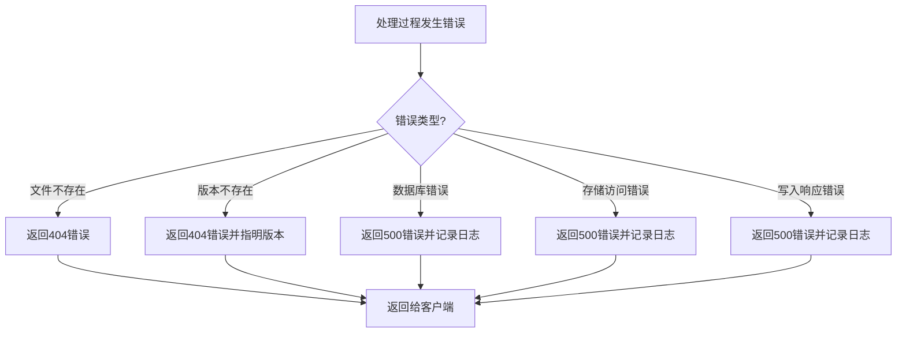
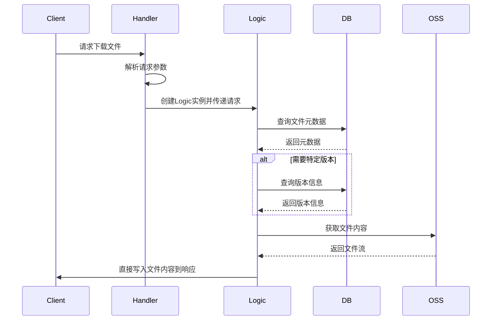

# 文件下载处理流程详解

本文档详细介绍文件下载的处理流程，并通过多个mermaid图表进行可视化说明。

## 整体流程概览

## 详细步骤分析

### 1. 请求处理与参数解析

### 2. 文件元数据查询

### 3. 版本处理流程

### 4. 文件获取与响应处理

### 5. 对象存储交互流程

## 数据库查询分析

## 数据库模型关系

## 错误处理流程

## 成功响应流程

## HTTP处理器与业务逻辑分离

## 关键点说明

1. **直接流式响应**: 下载逻辑直接将文件流写入HTTP响应，而不是返回JSON数据
2. **版本支持**: 支持下载指定版本的文件，实现文件历史版本访问
3. **合适的响应头**: 设置正确的Content-Type和Content-Disposition头，确保浏览器正确处理下载
4. **流式处理**: 使用io.Copy进行流式传输，避免将整个文件加载到内存
5. **错误处理**: 详细的错误检查和处理，确保用户获得清晰的错误提示

整个下载流程设计考虑了效率和用户体验，通过直接流式响应减少内存占用，支持版本化下载增强了系统功能性。
