# 获取文件元数据处理流程详解

下面我将详细介绍获取文件元数据的处理流程，并使用多个mermaid图表来可视化整个过程。

## 整体流程概览

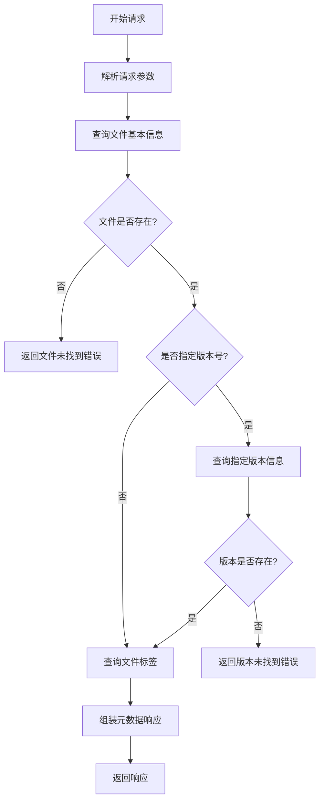

## 详细步骤分析

### 1. 请求参数解析

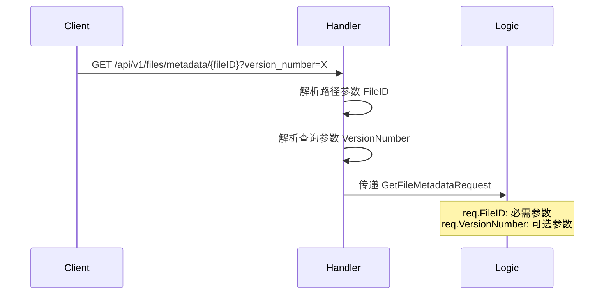

### 2. 文件基本信息查询

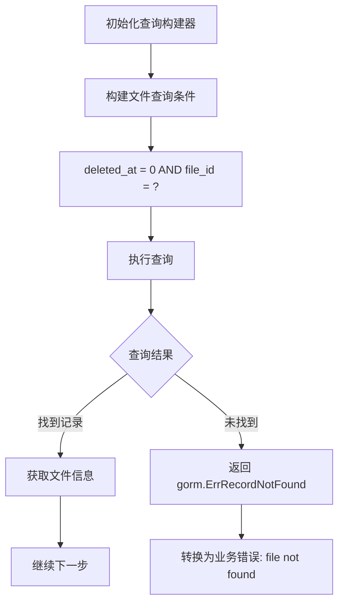

### 3. 版本信息查询（可选）

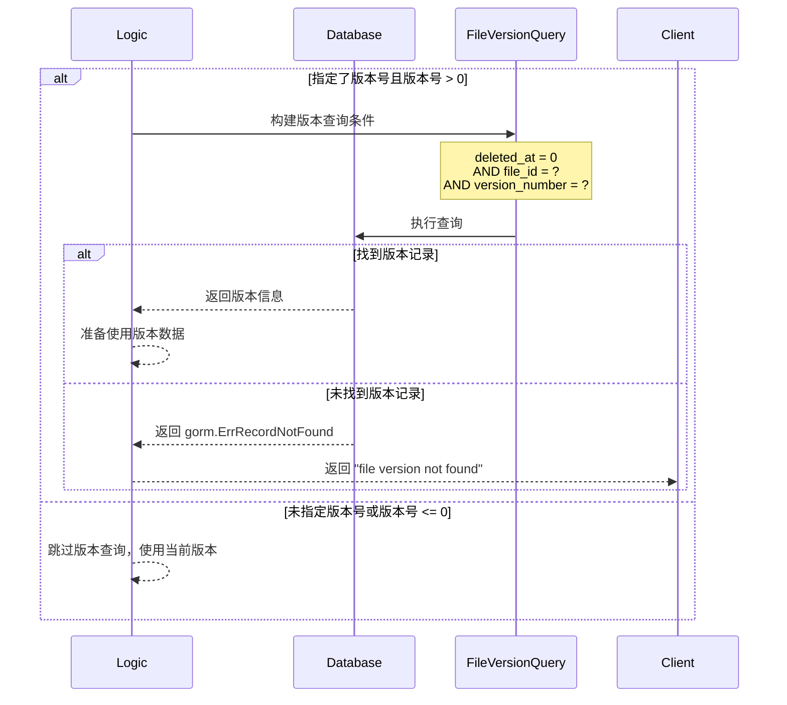

### 4. 标签信息查询

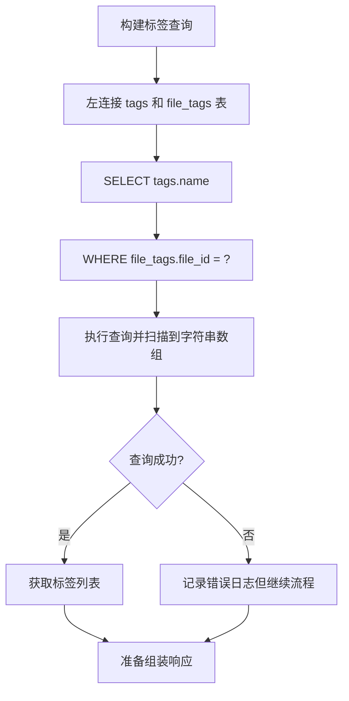

### 5. 元数据组装过程

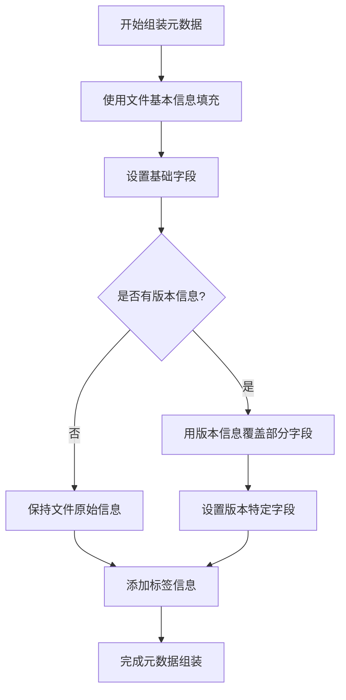

## 数据库查询关系图

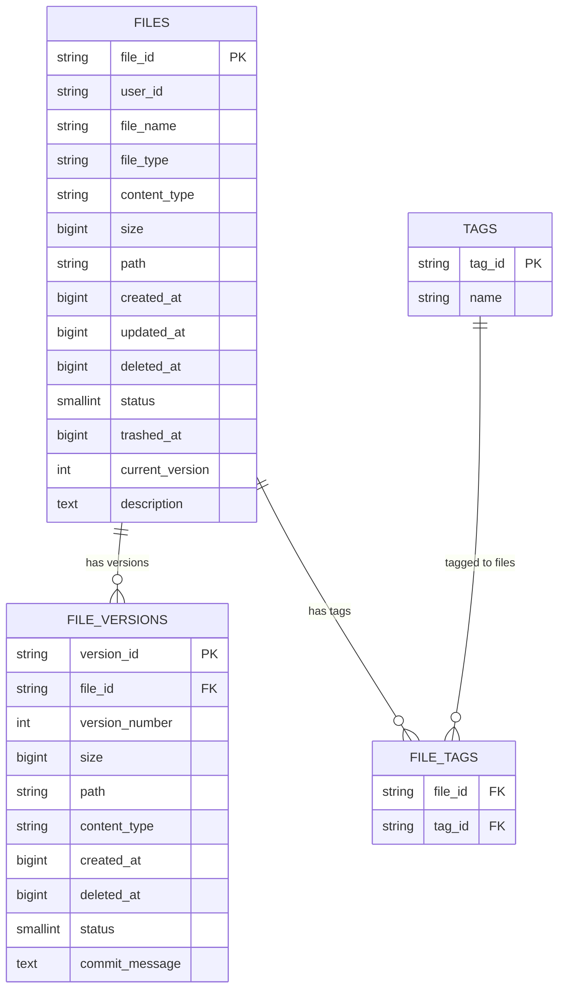

## 响应数据结构

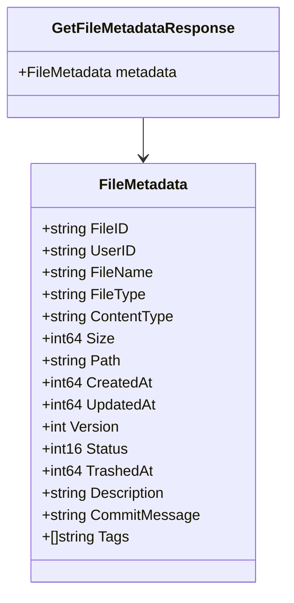

## 错误处理流程

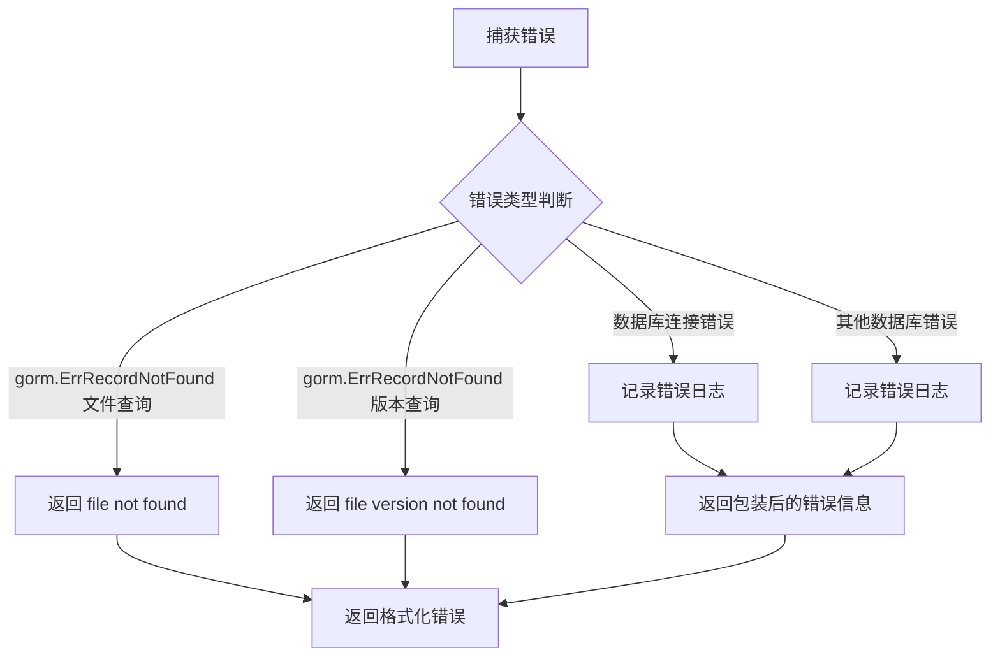

## 查询优化策略

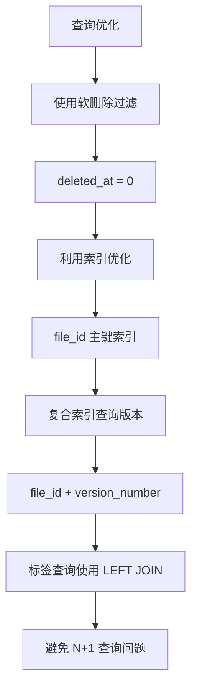

## 版本信息覆盖逻辑

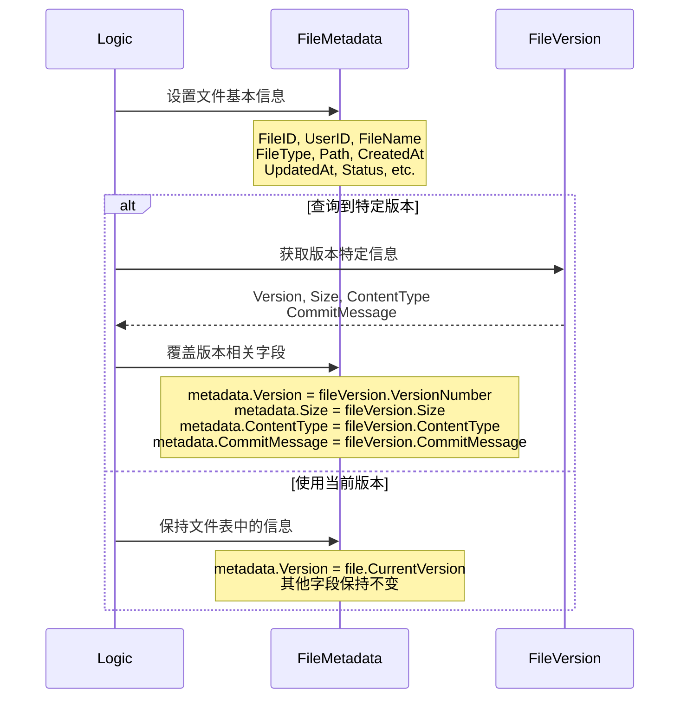

## API 调用示例流程

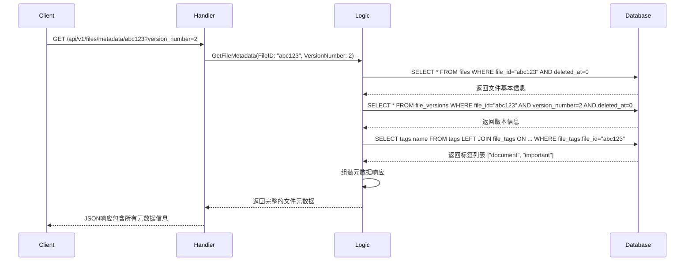

## 关键特性说明

1. **软删除支持**：所有查询都过滤 `deleted_at = 0` 的记录
2. **版本控制**：支持查询特定版本的元数据信息
3. **标签系统**：通过关联表查询文件的所有标签
4. **错误处理**：区分文件不存在和版本不存在的错误
5. **数据一致性**：确保返回的元数据信息完整准确
6. **查询优化**：使用适当的索引和查询策略提高性能

整个流程设计注重数据完整性和查询效率，为用户提供准确的文件元数据信息。
