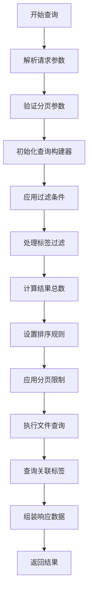
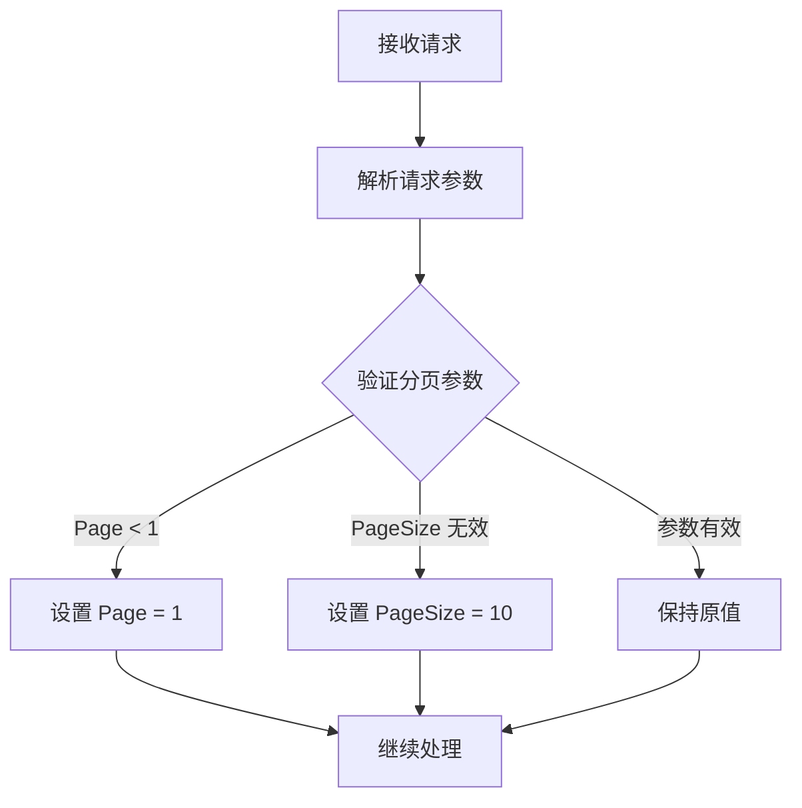
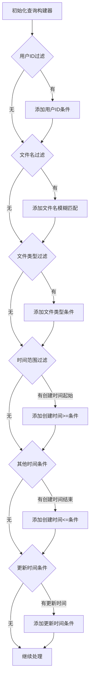
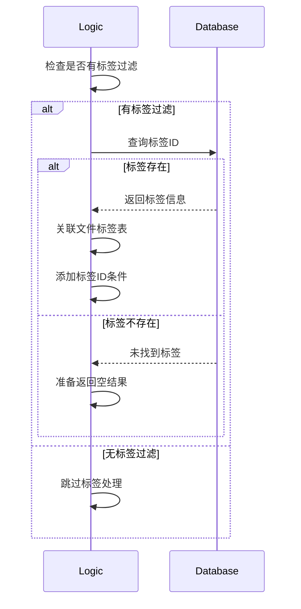
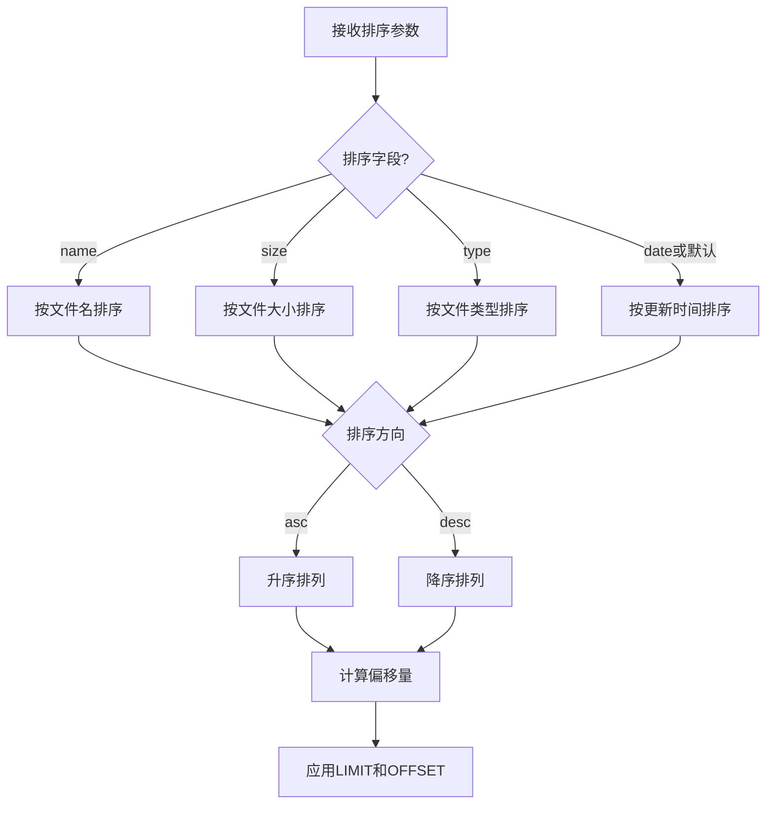
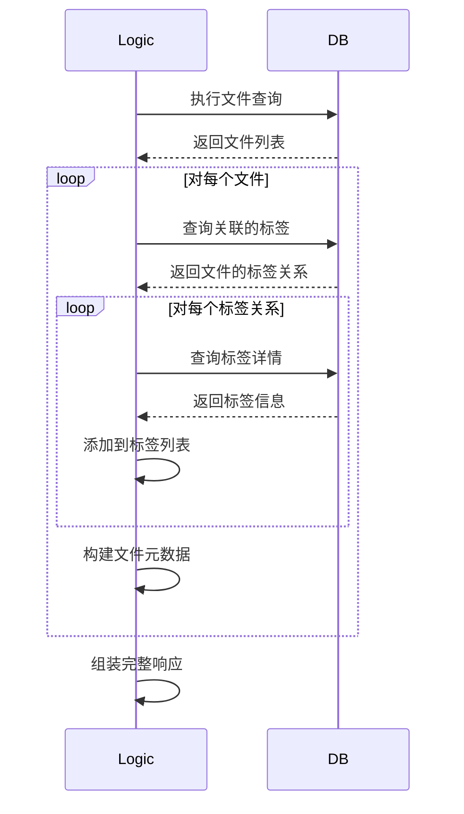
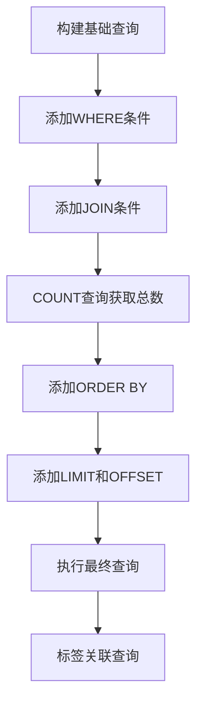
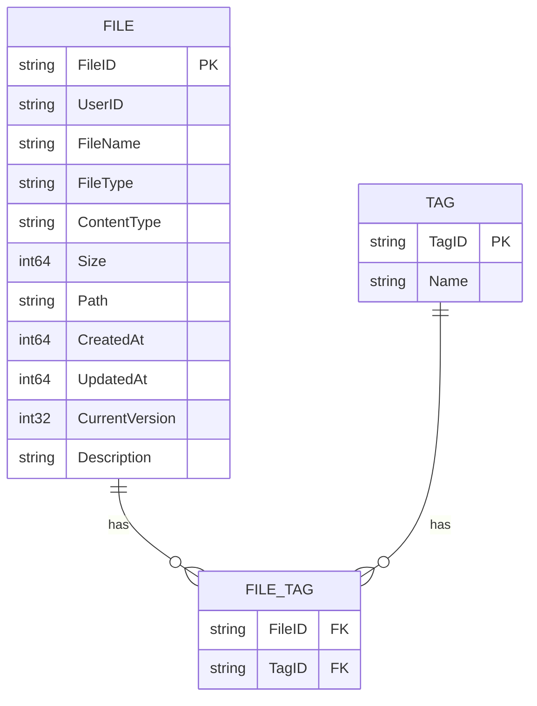
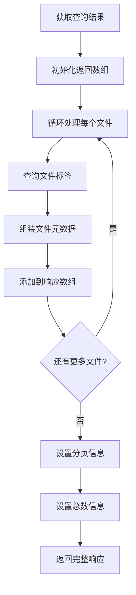
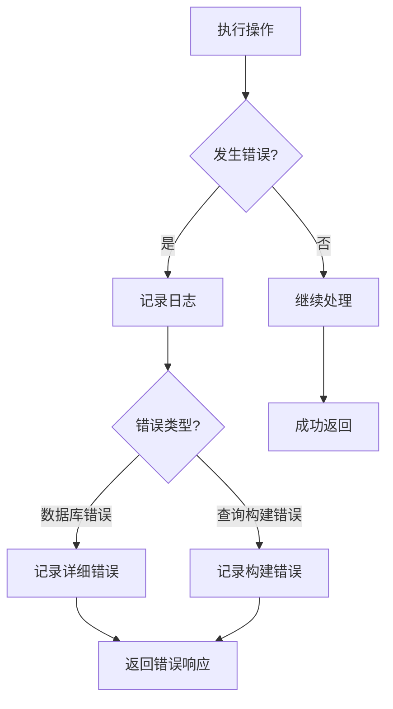

# 文件列表查询流程详解

本文档详细解释文件列表查询的处理流程。

## 整体流程概览

## 详细步骤分析

### 1. 请求参数解析与验证

### 2. 过滤条件应用

### 3. 标签过滤处理

### 4. 排序和分页处理

### 5. 查询执行和标签关联

## 数据库查询分析

## 关键结构示意图

## 过滤和排序处理流程

## 响应组装流程

## 错误处理流程

## 关键点说明

1. **高效过滤**：支持多种过滤条件，包括用户ID、文件名、文件类型、时间范围和标签
2. **灵活排序**：支持按文件名、大小、类型和日期的升序/降序排序
3. **标准分页**：实现标准的分页机制，控制返回结果数量
4. **标签关联**：通过关联查询获取每个文件的标签信息
5. **性能考虑**：先计算总数再获取分页数据，避免不必要的数据传输

整个查询流程设计考虑了灵活性、性能和数据完整性，确保文件列表查询结果准确且高效。
